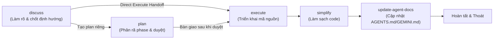

# Antigravity Workflow Skills Suite (`agy-skill`)

Bộ kỹ năng cộng tác và quản lý vòng đời phát triển phần mềm được thiết kế và tối ưu riêng cho **Google Antigravity (AGY)**.

---

## 1. Danh sách các Skill trong bộ

| Skill | Mục đích & Mô hình hoạt động | Antigravity Native Primitives |
| :--- | :--- | :--- |
| **`discuss`** | Thảo luận kiến trúc, làm rõ yêu cầu, ghi nhận quyết định vào bundle v4 (`./discussion/`). Cấm sửa source code bừa bãi. | `ask_question` cho Immediate Decision Gate; `replace_file_content`, `write_to_file`. |
| **`plan`** | Lập kế hoạch chi tiết (phases, dependencies, waves) vào `./plans/`. Plan-first boundary (chưa sửa code). | `ask_question` cho phê duyệt kế hoạch; `invoke_subagent` mapping cho phase candidates. |
| **`execute`** | Triển khai kế hoạch đã duyệt hoặc tracker thảo luận đạt điều kiện handoff. Evidence tracking, hoàn tất có kiểm soát. | `invoke_subagent` với `Workspace: 'branch'` (isolated worktree) hoặc `'share'`; chạy quality gates. |
| **`simplify`** | Rà soát và làm sạch code thay đổi gần nhất (4 góc nhìn: reuse, simplification, efficiency, altitude). | `invoke_subagent` chạy 4 reviewer song song; `replace_file_content`. |
| **`update-agent-docs`** | Tự động đồng bộ và cập nhật `AGENTS.md` / `GEMINI.md` khi session có thay đổi quan trọng về workflow / routing. | `invoke_subagent` discovery; `find_by_name`, `grep_search`. |
| **`interact-with-git-platform`** | Tương tác an toàn với GitHub (`gh`), GitLab (`glab`), Gitea (`tea`): PR/MR, issues, reviews, releases, CI. | `run_command`, `ask_question` cho xác nhận rủi ro / chọn remote; `write_to_file` cho body markdown. |

---

## 2. Luồng luân chuyển (Workflow Lifecycle)



---

## 3. Cách cài đặt & Kích hoạt trên Antigravity

Antigravity tự động phát hiện skill qua các đường dẫn chuẩn (xem thêm tài liệu `agy-customizations`):

### Cách 1: Sử dụng trong workspace dự án hiện tại
Sao chép hoặc symlink thư mục skill vào `.agents/skills/` của project:
```bash
mkdir -p .agents/skills
cp -R agy-skill/* .agents/skills/
```

### Cách 2: Cài đặt toàn cục (Global cho toàn bộ Antigravity)
Sao chép hoặc symlink vào thư mục cấu hình cá nhân:
```bash
mkdir -p ~/.gemini/antigravity-cli/skills/
# hoặc ~/.gemini/config/skills/
cp -R agy-skill/* ~/.gemini/antigravity-cli/skills/
```

### Cách 3: Khai báo qua `skills.json`
Đăng ký trực tiếp đường dẫn thư mục `agy-skill` trong `skills.json` của workspace.

---

## 4. Điểm cải tiến so với phiên bản Codex gốc

1. **Giao diện câu hỏi tương tác (`ask_question`)**:
   - Thay vì chỉ in text đánh số dạng markdown đơn thuần, agent tận dụng native tool `ask_question` để hiển thị modal trực quan có các tùy chọn và ô nhập viết tay (write-in), mang lại trải nghiệm tương tác tự nhiên trên UI của Antigravity.
2. **Subagents song song & Phân tách Workspace (`invoke_subagent`)**:
   - `execute` và `simplify` tận dụng trực tiếp tính năng `Workspace: 'branch'` của Antigravity để tự động cô lập workspace (tương đương git worktree) mà không cần can thiệp shell phức tạp.
   - Hỗ trợ cơ chế **Reactive Wakeup**: Agent chính không cần loop polling trạng thái ngầm, hệ thống sẽ tự động gửi thông báo đánh thức khi subagent hoàn thành.
3. **Bộ công cụ sửa đổi file chuẩn xác**:
   - Chuyển đổi toàn diện từ các lệnh patch cũ sang các công cụ chuẩn của AGY: `replace_file_content`, `write_to_file`, `view_file`, `grep_search`, `find_by_name`.
