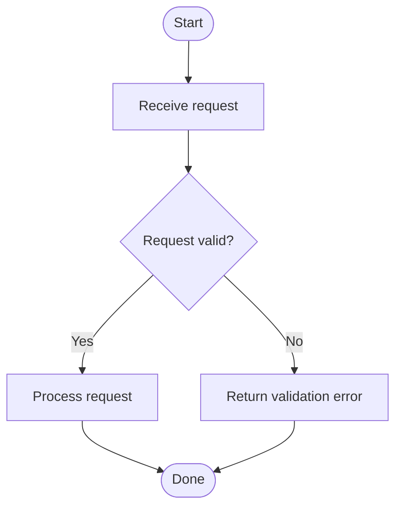

# Mermaid Flowchart Safe Syntax

Prefer Mermaid flowchart syntax that works across common Mermaid CLI versions.

## Baseline

Use stable shape forms:

- Process: `id[Label]`
- Decision: `id{Question?}`
- Terminal: `id([Label])`
- Data: `id[(Label)]`
- Subroutine: `id[[Label]]`

## Labels

- Use simple text when possible.
- Quote a label when it contains punctuation that Mermaid could parse structurally: `id["Call service: retry (3x)"]`.
- Replace literal line breaks with ` ` only when a compact label genuinely needs wrapping.
- Avoid embedding untrusted HTML. Do not add `click` directives or external links unless the user explicitly requests interactive output.
- Avoid experimental syntax when ordinary nodes and labeled edges express the same relationship.

## Configuration

Do not add an initialization directive merely for decoration. When configuration is required, keep it minimal and preserve any existing directive during focused edits.

Rendering is the authoritative syntax check. Do not treat visual inspection of source alone as validation.

If rendering fails before Mermaid reports a parse error, read [browser-runtime.md](browser-runtime.md) to distinguish browser discovery and process-sandbox failures from diagram syntax failures.
